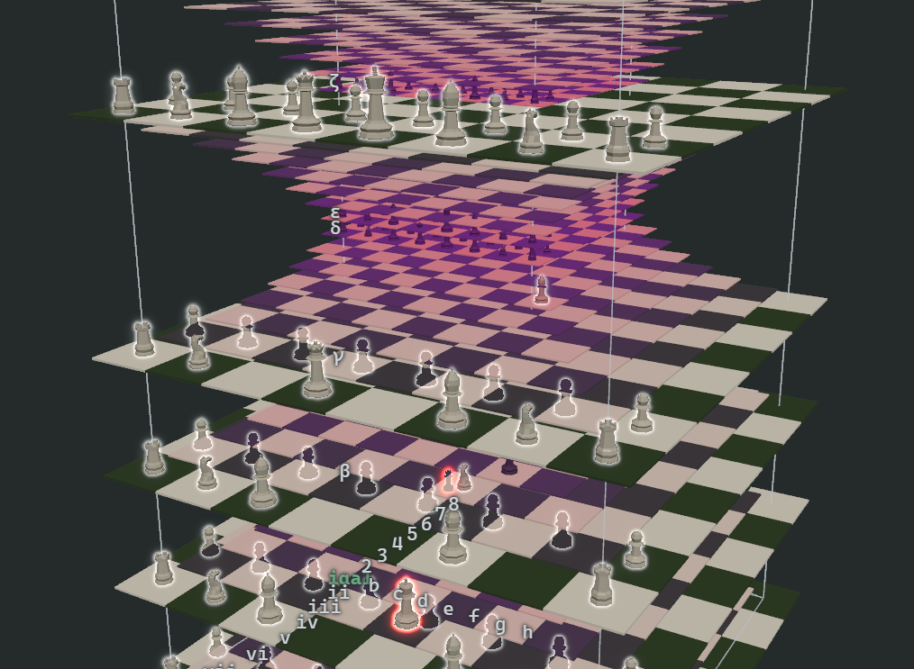

# n-dimensional chess



Vanilla JavaScript and ES modules, no build step. The engine has no dependencies;
the spatial viewer uses three.js, vendored and loaded through an import map.

```bash
npm start   # serves http://localhost:5173
npm test    # move generator test suite
```

## Layout

```
src/core/geometry.js   step-vector generation from dimension count
src/core/position.js   coordinates, board state, cloning
src/core/pieces.js     piece definitions as vector rules
src/core/movegen.js    legal moves, check, castling, en passant, perft
src/core/notation.js   n-dimensional FEN, square names
src/core/search.js     evaluation and the computer opponent
src/variants.js        board shapes and starting positions
src/ui/board.js        1D/2D boards and n-D slice grids
src/ui/spatial-gl.js   WebGL lattice viewer (three.js)
```

`src/core` has no DOM or three.js dependency and runs under plain Node. The
4D → 3D projection lives in the viewer: three.js is only ever handed 3D
coordinates.

